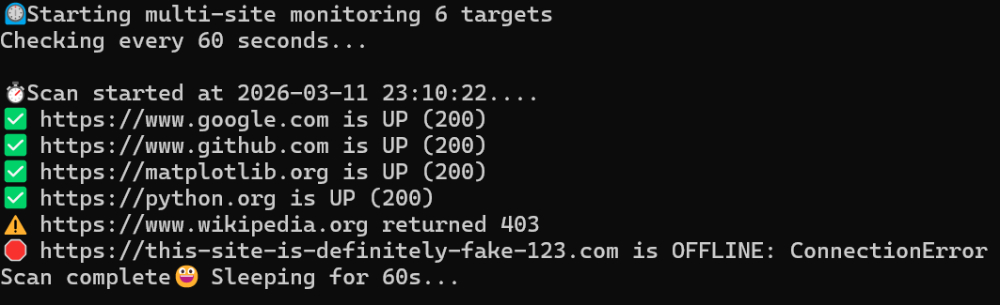

# 🌐 Python Site Uptime Monitor


A robust, lightweight Synthetic Monitoring tool built with Python. This script tracks the availability and latency of multiple web services, providing real-time console feedback and persistent, rotated logs for historical analysis.

---

# 📸 Screenshots


---

# 🚀 Features
- Multi-Target Monitoring: Check an unlimited number of URLs in a single loop.

- Intelligent Logging: Uses Python's logging module with RotatingFileHandler to prevent disk space exhaustion.

- Error Resiliency: Gracefully handles DNS failures, timeouts, and connection errors without crashing.

- Cross-Platform Ready: Explicitly configured for UTF-8 to support emojis and special characters on Windows and Linux.

- DevOps Best Practices: Implements modular functions, type hinting, and environment-specific configurations.

---

# 🛠️ Installation & Setup

## 1. Clone the Repository
```Bash
git clone https://github.com/yourusername/site-uptime-pinger.git
cd site-uptime-pinger
```
## 2. Create a Virtual Environment
```Bash
# Windows
python -m venv venv
.\venv\Scripts\activate
# Mac/Linux
python3 -m venv venv
source venv/bin/activate
```
## 3. Install Dependencies
```Bash
pip install -r requirements.txt
```
## 📈 Usage
Simply edit the sites_to_watch list in pinger.py and run:
```Bash
python src/pinger.py
```
Log Output Example
Logs are saved to uptime.log in the following format:
2026-03-02 16:15:00 - INFO - ✅ https://google.com is UP (200)

---

# 🏗️ Project Structure
```
site-uptime-pinger/
├── src/
│   └── pinger.py         # Main monitoring logic
├── uptime.log            # Auto-generated log file (Rotated at 5MB)
├── requirements.txt       # Project dependencies
└── README.md              # Project documentation
```

---

# 🛣️ Roadmap Features

- [ ] Email Alerts: Integration with SMTP to send daily uptime reports.

- [ ] Dockerization: Create a Dockerfile to allow the script to run in any containerized environment.

- [ ] Dashboarding: Basic CLI-based dashboard using the rich library for better visuals.

- [ ] Response Time Tracking: Measure and log latency (ms) for each request.

---

**Built by Roy Peters** [Click here to contact me](https://www.linkedin.com/in/roy-p-74980b382/)